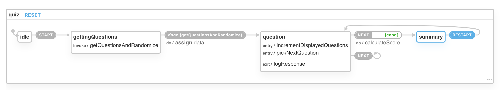

# Notes

## State Machines

So why did I use state machines for this exercise? 

Traditionally I would have used a simple fetch, axios or zeit's SWR hook to interact with the API and leverage useReducer at the page or quiz level to keep track of the state of the quiz engine.

This is absolutely valid and our teams use this approach on the majority of the cases unless we have to keep state across screens. 

During the last 6 months, I've been considering the use of StateCharts (state machines) in the UI development. 
My analysis - so far - is that it has the potential to solve problems before, during and after coding. As always it is a tool and not a magic bullet. It can be an overkill in many ocassions. Anyhow, I thought it would be an interesting conversation for an interview :)

Here is the early version of the engine - which I design based on the requirements - to test my design/mental model/solution

Even better, we can actually play, test and simulate user events here https://xstate.js.org/viz/?gist=c48d51f8787b9a09bee29e816c452e1d

The same machine definition we used for discussions and preliminary testing we can directly plug it in our code.

At the end the engine is framework agnotics and therefore reusable across React, Angular, Vue, Server side, etc....Does this make it future proof?

## Typescript
I've noticed the default setup is Typescript.
While I really like TS, we have just recently adopted it and Im still learning.
I've decided to default to ES6 and focus on demonstrating other concepts.
Nevertheless, right away we can see TS value when the event's name to be dispatched is defined in a file and invoked in another. Simple but clear case for it.

## Randomizing Results

Ideally I would delegate the randomization to the backend, via adding a a parameter to a query on GraphQL or adding a flag or new route if doing REST.

I'm a big proponent of the UI team to own or be an active collaborator on a Backend for Frontend layer which could be fulfilled - ideally but not limited - by GraphQL .

For this exercise, I decided not to modify the expressJS API as I believed the focus to be exclusively on the UI.

## Services URLs

For practical reasons, I've hardcoded the URL of the backend.
For PROD, I would move them into ENV variables being injected at build time.
This would allow us to build once and move the same binary across multiple environments hitting different services' instances.

## Testing

Given a personal time constraint, I've dcided to add example of different types of testing techniques instead of adding all possible combinations to satisfy a decent covergae. 

I've added an example on how to unit test the state machine.

If we could provision the right environment, simply removing the http mocking we can turn the test into an integration test without the need of interacting with an UI. It would cover engine->api integration for a hypothetical reusable complex logic with side effects. 

I've also added an example of testing a React component using React testing LIbrary.

Finally I've added an E2E test using Cypress where we could also mock the HTTP and make it an integration test only.

## Avoid including lodash.shuffle

While we have included only shuffle, if we are cautous about final bundle size, then we could easily replace it by a more simple implementation.

      function shuffle(array) {
        var currentIndex = array.length, temporaryValue, randomIndex;
      
        // While there remain elements to shuffle...
        while (0 !== currentIndex) {
      
          // Pick a remaining element...
          randomIndex = Math.floor(Math.random() * currentIndex);
          currentIndex -= 1;
      
          // And swap it with the current element.
          temporaryValue = array[currentIndex];
          array[currentIndex] = array[randomIndex];
          array[randomIndex] = temporaryValue;
        }
      
        return array;
      }

## Avoid including he lib for decoding

One alternative is to use lodash.decode which is 10x smaller.
Only caveat is the &#039; entity which is not included in the lib.

If we wanted to overcome it we could sanitize in the backend. 
If we did have the possibility to influence that decision, we can use Stringiy with a replace fn and reg exression to remove the extra 0.